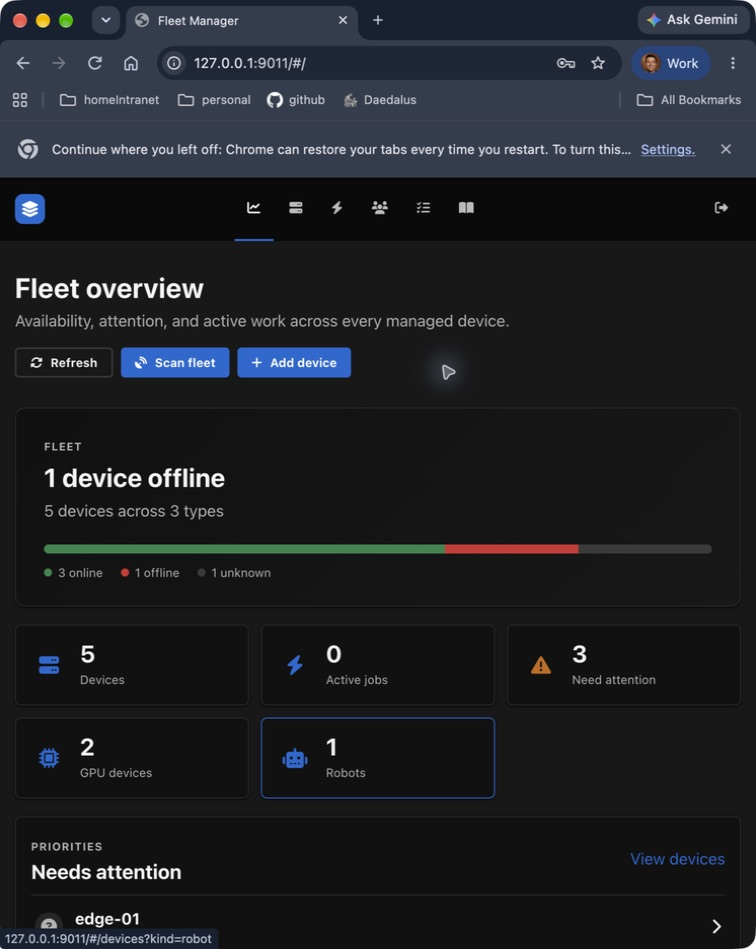
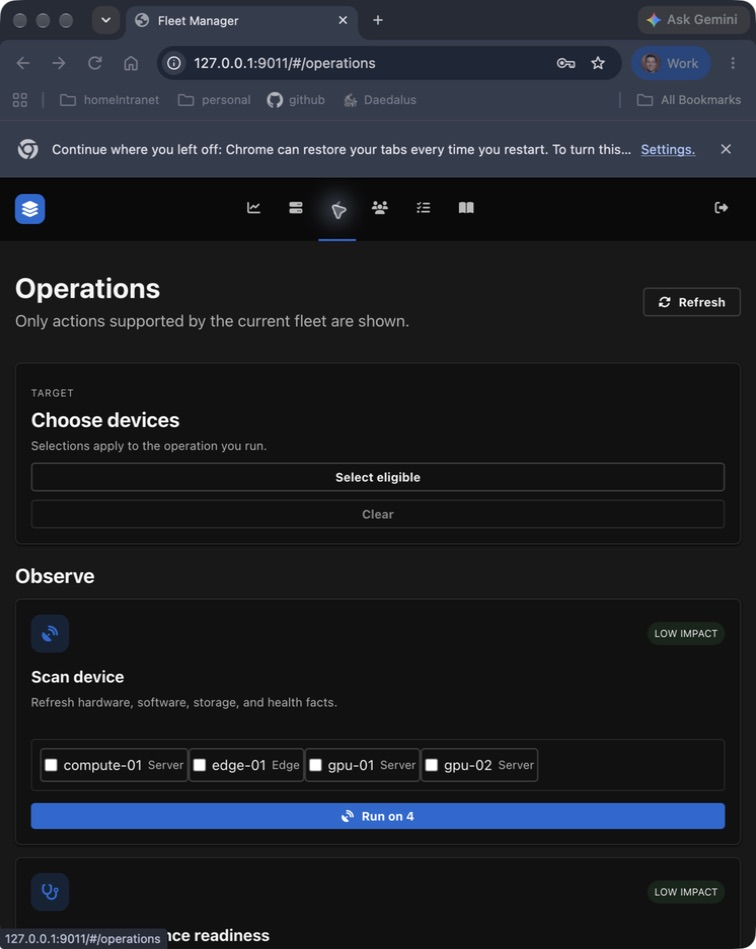
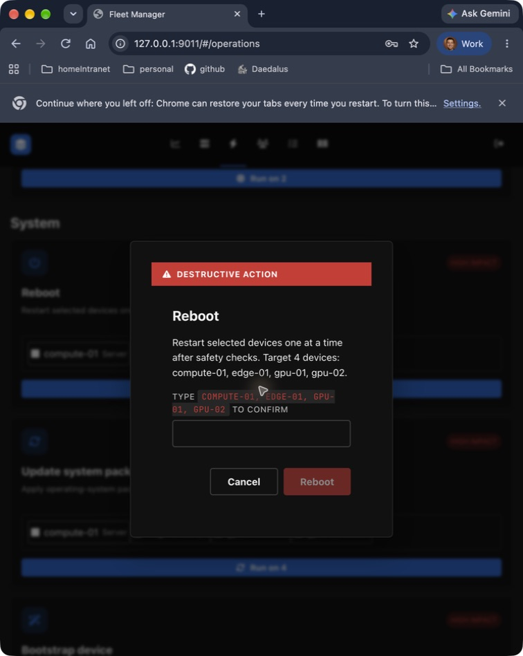
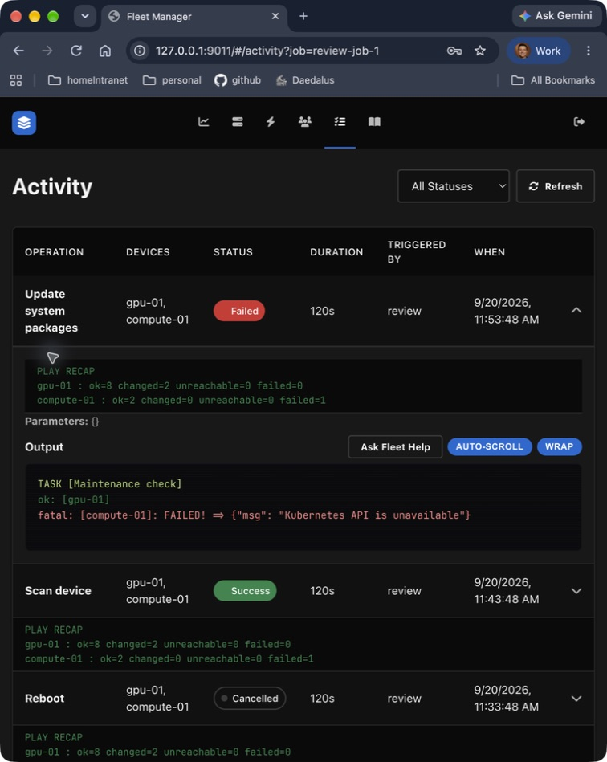
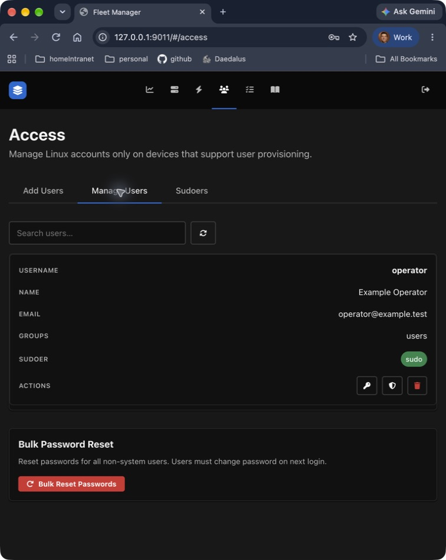
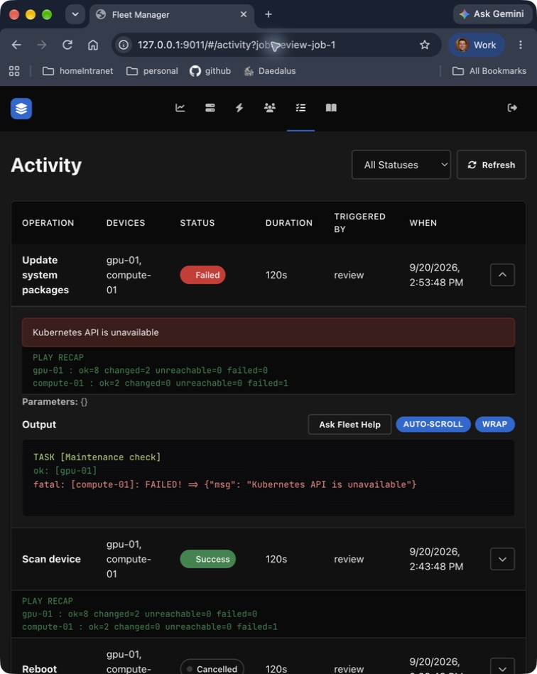
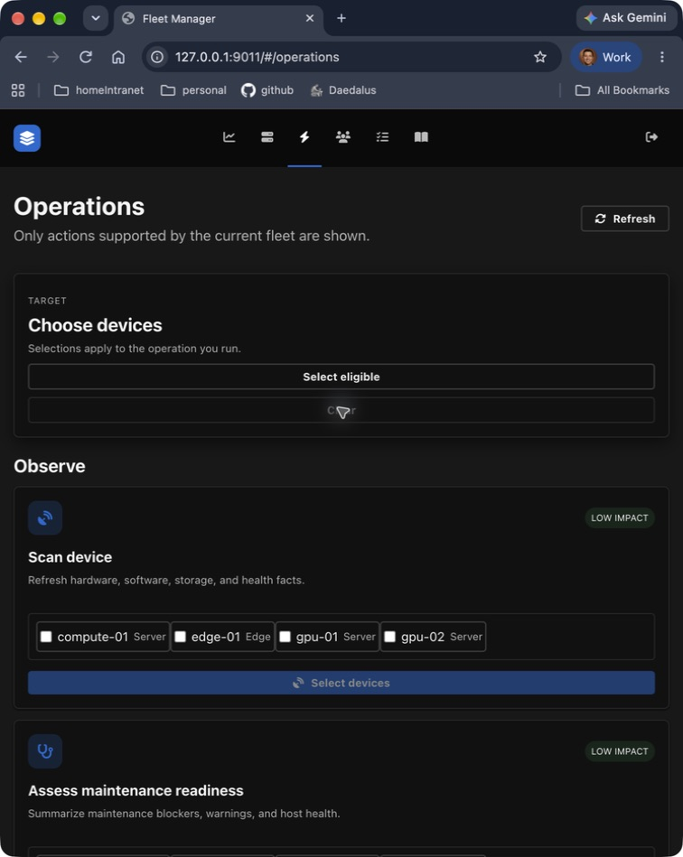

# Fleet operations review

Implementation follow-up: [reliability changes and validation](reliability-implementation.md). The findings below describe the review baseline, before those changes.

Reviewed 2026-09-20 against `67caf87`, plus the corrective changes in this working tree.

## Verdict

The product has a useful foundation for an Ubuntu/NVIDIA fleet, but it does **not yet provide excellent general server-maintenance coverage or consistently trustworthy results**. The largest gaps are target and platform eligibility, per-device outcomes, recovery after interrupted maintenance, and the connection between completed actions and displayed fleet state.

The operation catalog contains **19 actions: 15 Ansible-backed and 4 Reachy API-backed**. Access adds provisioning, password changes/resets, sudo grants/revocation, and account removal. All 26 top-level playbooks are reachable directly or through imports, but this measures file reachability, not functional coverage. Fabric Manager, MIG, and Kubernetes expose status checks in the UI even though their playbooks contain additional CLI modes.

This review covers the UI catalog, API dispatch, discovery and eligibility, playbook behavior, job execution, results, and adjacent device/access/context controls. It includes a focused screen audit of overview, targeting, confirmation, activity, and access. It is the input to the complete UI review, not a claim that the complete visual/accessibility audit is finished.

## Changes made during this review

| Finding | Correction | Verification |
| --- | --- | --- |
| Empty or cleared operation selections silently became all eligible devices | Explicit selection is now required; zero targets disables Run; duplicate submissions are guarded while starting | Two frontend targeting tests and browser check of select-one/clear |
| Completed scans consumed every JSON file in the shared scan directory, including other jobs; no report directory left an unreachable device marked online | Scan output is scoped to the job ID; ingestion filters target hostnames; missing reports still update unreachable/unknown status | Runner payload test and scan-isolation/missing-directory regression tests |
| Operation launch discarded its job link; Activity wrote a `job` query but did not restore it | Catalog launch navigates to its job; direct links load and expand that job, including one outside the latest list | Browser opened a direct failed-job URL and showed expanded details |
| Activity hid the saved error summary, hard-coded Pacific time, and omitted Cancelled from its filter | Error summary is visible; timestamps use the existing local-time formatter; Cancelled is filterable | Build and browser screenshot |
| Activity expansion lacked a keyboard-operable control; narrow-screen navigation lost accessible names | Added labeled expansion buttons and persistent navigation labels | Browser accessibility tree |
| Bootstrap could create groups and grant passwordless sudo before its Ubuntu-only Docker play rejected the platform | Added an all-target platform check before imported mutation plays | Ansible check-mode run on the local non-Ubuntu controller stopped before imports |
| Grant sudo silently skipped nonexistent accounts and could still reconcile the job as successful | Missing requested accounts now fail before sudoers writes on that host | Ansible syntax/lint; remote account mutation was not executed |
| Driver and bootstrap descriptions omitted consequential side effects | Driver copy now mentions possible reboot/workload interruption; bootstrap names passwordless sudo and Docker access | Source review and frontend build |

These changes are local and uncommitted. No live fleet operation was executed and the running production stack was not rebuilt.

## Highest-priority remaining findings

P1 means address before relying on unattended or broad fleet maintenance. P2 means required for a high-quality day-to-day experience. Findings below remain open unless the correction table says otherwise.

### P1: Access changes have broad scope and an inaccurate state model

`frontend/src/views/UserManagement.vue` sends `all_devices: true` for password changes, sudo grants/revocation, and removal. Only provisioning has target selection. A single account's password modal does not enumerate that fleet-wide target set; sudo toggles submit immediately. The UI receives `device_ids` but does not show account placement in the managed-user list.

`backend/models.py` stores `groups` and `is_sudoer` on `ManagedUser`, globally. `_apply_completion_action()` updates those global values even if the request targeted one device. It only applies completion changes when the entire Ansible run returns zero, so a mixed-success provisioning/removal job leaves successful hosts unreconciled. Group updates append remotely but replace the stored group string. `remove_sudoers.yml` deletes only the Fleet-managed file; membership in `sudo`/`wheel` or other policy can still grant effective access.

**Required outcome:** per-device account associations with observed groups and managed sudo grants; explicit target preview for every mutation; per-host reconciliation after partial success; wording that distinguishes removal of a managed grant from revocation of all effective sudo rights. Test one successful host plus one unreachable host for each account action. The missing-account grant check is fixed, but these broader issues remain.

### P1: Runtime lifecycle can leave ambiguous or stranded maintenance

`backend/services/ansible_runner.py` creates in-process background tasks and host locks. They are not durable across web-process restart and do not coordinate multiple processes. There is no startup reconciliation of pending/running execution state. `cancel_job()` terminates the Ansible parent, while the endpoint immediately marks the job cancelled; it does not establish that child processes or remote changes stopped. There is also a cancellation gap before the process is registered.

The credential FIFO is opened for writing before the process is registered and before `proc.wait(timeout=...)`. If Ansible exits before opening that FIFO, the writer can block outside the configured timeout. This is a code-path finding, not a reproduced production incident.

**Required outcome:** durable job ownership and restart reconciliation; bounded FIFO setup; process-group supervision; `cancelling` and `recovery_required` states; cooperative cancellation between maintenance steps; explicit accounting for remote work already accepted. Test child startup failure, cancellation while queued/starting/running, web restart, and two workers targeting the same device.

### P1: Kubernetes restoration does not establish that a node is healthy

Disruptive plays use `force_handlers: true`. `tasks/kubernetes_prepare.yml` schedules restoration before drain, and `tasks/kubernetes_restore.yml` uncordons solely from original schedulability. There is no node-Ready or workload-health check before uncordon. A reachable host with failed post-maintenance validation can therefore be returned to scheduling. An unreachable host or terminated Ansible process may never run restoration.

**Required outcome:** distinguish drain failure from maintenance failure; verify SSH, expected mounts/services, GPU health when relevant, and Kubernetes Ready before returning workloads. Keep an unhealthy node cordoned, record the reason, and expose a recovery action. Prove the policy with injected drain, package, reboot, health-check, and uncordon failures. Ansible documents that forced handlers can still be prevented by unreachable hosts. [Ansible error handling](https://docs.ansible.com/projects/ansible/latest/playbook_guide/playbooks_error_handling.html).

### P1: Eligibility advertises unsupported platform operations

`device_capabilities()` adds all base Linux capabilities to every SSH device, including bootstrap and account management. `enrich_from_scan()` adds package updates and container cleanup unconditionally and grants NVIDIA driver management based on GPU identity. The underlying paths are narrower: bootstrap and provisioning are Ubuntu-only; package updates support Debian/Red Hat families; the driver updater is Debian-specific and recognizes only `nvidia-driver-N` and `nvidia-driver-N-open` metapackages. An installed `-server` variant or platform-specific package layout is not preserved by that selection logic.

GPU inspection dispatches to `nvidia_gpu`, which inventory currently derives from the driver-management capability rather than the inspection capability. This couples read-only GPU visibility to a mutation capability and can produce a no-hosts-matched run for inconsistent/stale capabilities.

**Required outcome:** separate inspection support from mutation support; record OS distribution, package manager, installed package variant, container runtime, and verified integration prerequisites. Return an eligibility reason for each excluded device. Reject unsupported actions before queuing, and verify every requested target appears in the execution outcome. Bootstrap now rejects unsupported platforms before mutating them; the catalog still needs accurate gating.

### P1: Status checks can succeed without answering the question

Firmware inventory, Fabric Manager status, MIG status, and Kubernetes readiness deliberately tolerate probe errors and often finish successfully with empty output or an API-error line. The runner calls any zero exit code `success` without checking that all selected hosts were matched. Preflight's structured counters omit several health diagnostics; GPU query failures can look like absence of workloads. A successful job therefore does not consistently mean the requested information was obtained, much less that the device is healthy.

**Required outcome:** a common per-device result contract distinguishing execution status from findings: `passed`, `warning`, `blocked`, `unsupported`, `unreachable`, `not_checked`, and `changed`. Include check errors and timestamps. A zero-target run must fail; a missing required probe must never become a health pass. Keep optional-tool absence distinct from required-tool failure.

### P1: Driver/system maintenance lacks a complete plan-and-verify contract

Driver updates can reboot, check GPU processes before Kubernetes drain, and suppress errors in workload probes. They may therefore reject a normally drainable busy Kubernetes node, or fail to distinguish an unreadable workload list from an idle GPU. Fabric Manager package compatibility is not coordinated with the chosen driver package. Some post-service failures are warnings rather than failed verification.

System updates execute `apt upgrade: dist` or `dnf name: '*' state: latest`; the UI offers no package/security scope, package preview, exclusions, or reboot policy. The apt task does not enable the module's removal guard (`fail_on_autoremove`), so it provides no no-removal guarantee. [Ansible apt module](https://docs.ansible.com/projects/ansible-core/2.18/collections/ansible/builtin/apt_module.html). There is no explicit health-gated rollout/failure-budget contract. Existing serial execution reduces simultaneous impact but is not a complete canary workflow.

**Required outcome:** immutable plan showing selected packages/versions, removals, estimated disruption and reboot policy; verified supported NVIDIA package strategy; drain before the final idle-workload check; fail closed on required probe errors; verify driver, fabric and services before proceeding. Use operation-specific checkpoints rather than a generic emergency override.

### P2: Ordinary standalone maintenance depends on controller Kubernetes access

Every disruptive path calling `kubernetes_prepare.yml` tries the Kubernetes API and refuses work when it is inaccessible, even when no local membership marker exists. The default Compose configuration mounts `/dev/null` without a kubeconfig. This is documented safety behavior, but leaves ordinary standalone reboot/update/bootstrap unusable through the UI unless the controller can query a cluster. The UI cannot configure cluster context or an explicit standalone policy.

**Required outcome:** a visible, verified device management mode and cluster association. Preserve fail-closed behavior for known/possible Kubernetes nodes; provide an explicit standalone policy that does not depend on access to an unrelated cluster. Do not solve this by adding a UI `force=true` shortcut.

### P2: Fleet state and counts can mislead after an action

Only scan/bootstrap reconcile SSH facts. Reboot, package update, cleanup, driver update, and firmware update do not refresh the displayed reboot flag, disk use, driver version, or health. `DeviceDetail.scan()` queues an SSH job without polling for its result or refreshing facts afterward. Historical `online` is presented as current reachability. The shared store's refresh polls the database, not the hosts.

`Dashboard.vue` counts attention after truncating the list to seven findings, undercounting larger fleets. `stores/devices.js` derives active jobs from only the ten most recent jobs, so an older running job disappears after enough newer jobs. Failed job-list retrieval becomes an empty list and can look like zero active work.

**Required outcome:** show observation age and source, mark stale/unknown explicitly, refresh relevant facts after verified changes, compute full counts independently of display limits, and query active work independently of recent history. Preserve visible error state when refresh fails.

### P2: Reachy work bypasses the shared execution protections

Reachy health/log collection run inside the request and process devices sequentially; large selections can exceed the frontend timeout. Daemon restart/update use separate background tasks without the Ansible host locks or concurrency limit, so conflicting operations can overlap. `_poll_reachy_job()` fails on an individual request exception, including a transient disconnect during daemon restart. Its 900 iterations plus per-request timeouts are not a strict 30-minute wall-clock deadline. Reachy result/indexing behavior differs from Ansible jobs; direct device scans do not create Activity entries.

**Required outcome:** one queue and per-device conflict policy for both transports, actual deadlines, reconnect tolerance, recoverable remote job IDs, and uniform result/audit records. Keep cancellation unavailable after an irreversible remote job is accepted, but make that limitation clear before submission.

## Full operation inventory

All entries below were traced through the current catalog and dispatch. “Needs work” is an implementation/coverage finding, not a claim that the operation was run on hardware.

| UI operation / ID | Implementation | Assessment and missing coverage |
| --- | --- | --- |
| Scan device / `system.scan` | `host_facts.yml`; scan ingestion; inventory regeneration | Broad hardware/storage facts and capability discovery. Job isolation fixed. Needs stale-data semantics, probe errors, and cross-platform reboot detection. |
| Assess maintenance readiness / `system.assess` | `maintenance_assessment.yml` imports preflight and diagnostics | Good diagnostic breadth and assessment artifact. Structured verdict excludes many later diagnostics; does not automatically gate the selected maintenance action. |
| Analyze storage / `storage.inspect` | `storage_analysis.yml`, `files/storage_discovery.py` | One of the strongest paths: mount discovery, ownership analysis, structured results, bounded probes and tests. Needs visible inode/read-only/SMART/RAID findings and a reviewed cleanup plan. |
| Inspect GPU usage / `gpu.inspect` | `gpu_usage.yml` | GPU/process/container-owner report; errors if no GPU records. Process-query failure still resembles no processes. NVIDIA-only grouping is coupled to driver-management eligibility. |
| Reboot / `system.reboot` | `reboot.yml`, UI supplies `force_reboot=true` | Rolling execution, fstab verification and reconnect are good. `force_reboot` means reboot even without a reboot flag, not a Kubernetes bypass. Needs final health gate, stale-flag refresh and recovery state. |
| Update system packages / `system.update` | `system_update.yml` | Debian/Red Hat implementation with rolling batches. Needs preview, security-only/selected scope, maintenance window/reboot controls, portable reboot detection, and results beyond logs. |
| Bootstrap device / `system.bootstrap` | group/admin/Docker/scan imports | Broad, privileged composite action. Platform validation now precedes changes. Needs plan of actual groups, administrator and packages; service disruption/cluster setup visibility; supported-platform eligibility. |
| Clean container cache / `containers.cleanup` | `docker_cleanup.yml` | Preserves volumes; prunes unused images/build cache/networks. Needs age/size preview, reclaimed-byte result and explicit runtime scope. Containerd cleanup is limited to a legacy device group. Missing/inactive runtime can be a successful no-op. |
| Update NVIDIA drivers / `nvidia.driver.manage` | `driver_upgrade.yml`, `upgrade_mode=standard` | Branch-oriented update and structured before/after report. Reboot risk now disclosed. Needs package-variant support, matching fabric packages, reliable workload checks and supported DGX/Jetson policies. |
| Check Fabric Manager / `nvidia.fabric_manager.manage` | `fabric_manager.yml`, `fabric_action=status` | Read-only UI check. Start/stop/restart are CLI-only. Needs reliable service-presence detection, structured service state and actionable recovery. |
| Check MIG mode / `nvidia.mig.manage` | `mig_management.yml`, `mig_action=status` | Read-only UI check. Enable/disable are CLI-only; no GPU-instance/profile management. Before exposing mutation, fix mixed-GPU mode decisions and re-query after changes. |
| Inspect firmware / `firmware.inspect` | `firmware_inventory.yml` | fwupd and optional NVIDIA inventory. Errors are suppressed; needs typed inventory, available-release selection, tool errors and device compatibility. |
| Update firmware / `firmware.update` | `firmware_update.yml`, `firmware_mode=update` | Rolling fwupd update without automatic reboot. Handles documented no-action exit code 2. Needs release/target preview, pending activation/power-cycle result and recovery instructions; `/var/run/reboot-required` is not sufficient firmware activation evidence. |
| Check Kubernetes readiness / `kubernetes.drain` | `host_drain.yml`, `drain_action=status` | Reports membership and original schedulability; this does not prove a drain will succeed. UI has no drain/resume. Add Ready/PDB/eviction blockers and explicit node/context identity. |
| Check Reachy health / `reachy.health` | synchronous daemon probes | Updates connectivity/facts and stores a Job. Needs common queue, per-device errors, consistent discovery timestamp and indexing. |
| Collect Reachy logs / `reachy.logs.read` | bounded WebSocket snapshot | Bounded per-device capture is useful. Needs asynchronous fleet collection and consistent redaction/result handling; distinguish no logs from failed capture. |
| Restart Reachy daemon / `reachy.daemon.restart` | remote job submission and polling | Uses the daemon's restart endpoint. Needs reconnect tolerance, per-device locking and post-restart verification. No motion endpoint is directly invoked; physical behavior was not tested. |
| Update Reachy software / `reachy.software.update` | remote update job | Needs current/target version, availability check, durable remote-job tracking, common locking and verified completion. |
| Reset Reachy apps / `reachy.apps.reset` | `reachy_app_reset.yml`, verified SSH | Strong fixed-path deletion and daemon-directory guard; typed UI confirmation. Needs active-app conflict handling, recovery/reinstall guidance and a structured result. No deletion was performed during review. |

Firmware exit semantics were checked against the upstream manual. [fwupdmgr manual](https://github.com/fwupd/fwupd/blob/main/src/fwupdmgr.md).

## Access and supporting UI actions

| Surface/action | Current implementation and conclusion |
| --- | --- |
| Manual/CSV account provisioning | Structured records and secret validation; explicit device selection; completion is deferred until successful execution. Ubuntu-only, assumes `/home` and `/raid`, copies profile templates into existing accounts, offers no SSH-key entry. Blank password creates an account without a usable credential provisioned here. Needs clear new/existing-user plan and per-host results. |
| Change password | Validated request and `change_password.yml`; no-log password task. UI always targets the eligible fleet rather than account placement; user does not preview those devices. Needs explicit scope and completion feedback. |
| Bulk password reset | Typed confirmation; regular-user UID bounds, system-account exclusions and forced next-login change. UI always selects all eligible hosts and all eligible users. Needs per-host affected-user preview and safeguards for automation accounts. |
| Grant managed sudo | Writes a validated passwordless `NOPASSWD:ALL` file. Missing requested accounts now fail. Needs visible privilege scope, target confirmation, and per-device state. |
| Remove managed sudo | Deletes a named sudoers file, not every source of sudo access. Needs precise wording and effective-access verification rather than an unconditional global “not sudoer” badge. |
| Remove account | Protects root and automation/admin accounts, preserves home by UI default, removes its managed sudo file. UI targets the whole eligible fleet. Needs per-host confirmation and partial-success reconciliation. |
| Edit groups/shell | API exists (`PUT /users/bulk-update`) but no UI control. Do not count it as UI coverage. Remote group changes append while stored state replaces; needs per-device reconciliation. |
| Add/discover SSH or Reachy device | Transport-specific flow, SSH fingerprint approval and encrypted stored secrets are good foundations. Needs explicit unsupported/partial discovery states and clear reachability versus trust status. |
| Device CSV import/export | Import has discovery/trust review; export excludes stored secrets. Needs scalable partial-failure correction and clear distinction between connection manifest and full backup. |
| Scan fleet / single-device scan | SSH queues a job; Reachy probes inline. Needs unified jobs, progress, result links and refresh after completion. |
| Edit endpoint/SSH user | Updates inventory. SSH identity/capabilities and cached facts are not invalidated when endpoint changes; a different already-trusted host can inherit old eligibility. Needs rediscovery and conflict handling with active jobs. Reachy endpoint changes correctly revoke reset access. |
| Remove device | Typed confirmation; removes saved connection/associations, preserves job history and detaches documents. Needs active-job protection and explicit effect on queued inventory. |
| Enable Reachy app reset | Dedicated verified SSH setup is appropriately separate. Test real robot account/path support and conflict behavior before relying on it. |
| Manual device attributes | Validated keys/limits and explicit re-index message. Needs dirty/saved/searchable state and provenance separate from discovered facts. |
| Upload/delete context documents | File/type/size/duplicate controls and deletion confirmation. Removal leaves derived index records until re-index, disclosed in UI. Needs a persistent “index out of date” indicator and reliable deletion propagation. |
| Re-index context | Background progress and conflict response. Needs durable status/recovery and last-success versus current-index distinction. |
| Fleet Help / ask about job | Fresh database job evidence and device/job scoping are useful. It is an explanatory aid, not a substitute for deterministic per-host results. This review did not invoke external models or MCP services. |
| Activity expand/filter/log wrapping/auto-scroll | Structured cards for assessment, GPU, storage and driver reports, plus raw logs. Direct links, error summary, keyboard expansion, Cancelled filter and local time fixed. Needs pagination/search/device filtering, live list refresh, result export and recovery actions. |
| Cancel job | API exists, but no visible UI action or frontend wrapper. Do not expose until the lifecycle/recovery behavior above is corrected. |
| Sign in/out and refresh | Existing authentication and throttling are present. Shared-admin permissions remain coarse; operational errors should stay visible rather than look like empty fleet/activity data. Multi-operator authorization is a later architecture requirement. |

## Coverage priorities

| Priority | Common maintenance need | Present coverage | Recommended increment |
| --- | --- | --- | --- |
| First | Safe targeting and dependable outcomes | Partially corrected in this review | Complete per-device result/state contract, platform eligibility and durable execution/recovery |
| First | Package patching and planned reboot | Broad update + separate reboot | Package preview, security/selected scope, reboot-required detection per distro, post-change health and rollback/recovery notes |
| First | Service troubleshooting | Diagnostics bundle and Fabric Manager status | Service inventory, failed units, bounded journal filtering, selected service restart with dependencies and validation |
| First | Kubernetes maintenance | Status UI, CLI drain/resume, automatic maintenance drain | Explicit cluster/node association, drain preview/PDB blockers, cordon/drain/resume UI with recovery state |
| First | Account lifecycle | Provision/password/sudo/delete | Device-scoped accounts, SSH keys, lock/unlock, group/shell management and observed effective privileges |
| Next | Storage health and reclaim | Capacity/ownership + container cleanup | Inode/read-only/SMART/RAID health, age/size cleanup preview, safe journal/package-cache cleanup and reclaimed bytes |
| Next | GPU/driver/fabric maintenance | Good NVIDIA inspection; narrow update implementation | Supported package/platform matrix, driver/fabric compatibility, DCGM health, per-GPU MIG plans |
| Next | Network diagnosis | Some NIC facts and IB logs | Interfaces/routes/DNS/NTP/connectivity diagnostics; configuration changes only with rollback protection |
| Next | Firmware lifecycle | Generic fwupd inventory/update | Device/release preview, vendor-specific support, activation state and maintenance/recovery guidance |
| Next | Backup and restore readiness | Inventory CSV and logs only | Configuration/inventory backup, restore validation and explicit application/data-backup status |
| Later | Recurring maintenance and governance | Manual execution, one admin identity | Scheduling/windows, canary batches, maintenance groups, granular roles, approval policy and retention |

Do not expand the catalog by adding generic shell execution. Each new action should declare its supported platforms, prerequisites, exact target set, disruption, cancellation boundary, verification and recovery behavior.

## Requirements for the complete UI review

Use one end-to-end journey: **understand fleet state → choose devices → choose an eligible action → review a concrete plan → execute → inspect each device's result → verify refreshed state or recover**.

1. **Fleet truth:** separate last observed availability, observation age, active maintenance, and current health findings. Count across the entire fleet and show refresh failures. Include empty, stale, partially discovered and disconnected states.
2. **Target selection:** one shared searchable device picker with status, platform, cluster and eligibility reasons. Preserve explicit scope through navigation. Show selected, excluded and offline counts; clearing must mean none.
3. **Action planning:** show exact devices, side effects, versions/packages, reboot/service interruption, workload blockers and credentials/prerequisites. Replace long display-name typing at scale with a concise, stable confirmation plus visible target list. Keep typed confirmation for genuinely destructive actions.
4. **Execution:** show queue position, phase, per-device progress, concurrency and whether cancellation is still safe. A repeated click or retry after timeout must not duplicate work.
5. **Results:** summary first, per-device findings second, raw logs third. Distinguish skipped/unsupported/unreachable/warning/failed. Link directly to the job and affected device. Preserve results across reloads and large history sets.
6. **Recovery:** offer only actions appropriate to the failed phase, with known remaining work and a verification step. Do not label “cancelled” as “rolled back.”
7. **Access:** show account placement and privileges per device. Make scope and passwordless-sudo implications explicit. No hidden fleet-wide toggles.
8. **Accessibility and scale:** keyboard-only end-to-end flows, modal focus/return, status announcements, contrast measurements, 200% zoom, narrow screens, long names, 200-device selections and large job histories. Include loading and error states, not just populated success screens.

Acceptance scenarios should include partial success, a removed/changed device while queued, stale capabilities, unreachable hosts, failed required probes, unsupported distro/package variant, a non-Kubernetes fleet without kubeconfig, an unavailable cluster, drain/PDB failure, reboot timeout, failed post-health, failed uncordon, process restart, and cancellation at each phase.

## Captured flow and evidence

Screenshots use the built project frontend and actual read endpoints against an isolated five-device sample database. The review server rejects all mutations except its temporary local sign-in. Sample jobs are presentation fixtures, not real maintenance outcomes. Captures are from a narrow desktop Chrome window, approximately 756 px wide. Browser chrome is retained; images were saved and reopened unchanged. Screens not captured below received source review only.

### 1. Overview

Useful attention and active-work entry points. The screen does not foreground the age of its observations. At this width navigation was icon-only with unnamed accessibility links; the accessible-name issue is corrected. Full count/freshness defects require the code findings above, not this five-device screenshot alone.

### 2. Catalog before correction

No boxes selected, “Choose devices” displayed, yet “Run on 4” enabled. This directly demonstrates the targeting defect. Repeated per-card device lists and a long single-column catalog create a scaling problem for the next design pass.

### 3. Reboot confirmation before correction

Opening Reboot with no explicit selection targeted all four eligible sample devices. The dialog names them and focuses Cancel, which are useful safeguards, but the full display-name string is cumbersome and visually uppercased. No confirmation was submitted.

### 4. Activity before correction

The failure is discoverable through raw output, with wrapping and auto-scroll controls. The saved error summary was absent, recap text dominates the result, expansion lacked a real button, and timestamps were forced to Pacific time. Fixture recap rows are not evidence of real job correctness.

### 5. Access

Readable responsive account cards, but no device placement or per-action target scope is shown. The global sudo badge cannot describe differing privileges across hosts. Password/sudo/delete scope is established by the source review; no account mutation was attempted.

### 6. Linked result after correction

Direct navigation to the job URL opens its result. The error summary is immediately visible, expansion is a labeled button, and the timestamp uses local time. This verifies the corrected read path, not real remote execution or result reconciliation.

### 7. Cleared selection after correction

Selecting one device changed eligible buttons to “Run on 1”; Clear returned every action to disabled “Select devices.” This was checked in the browser and by the new targeting tests.

## Validation and limits

| Check | Result |
| --- | --- |
| Python tests | 128 passed, plus 16 subtests |
| Frontend tests | 6 passed |
| Frontend production build | Passed |
| Ansible syntax | 26/26 top-level playbooks passed |
| Ansible lint | Passed requested `min` profile; tool reported zero failures/warnings |
| DGX detection integration fixture | Passed, 28 tasks, zero changes |
| Bootstrap unsupported-platform guard | Check-mode integration passed on the non-Ubuntu controller, before mutation imports |
| Whitespace diff check | Passed for this review's changes |
| Browser checks | Catalog empty/select/clear behavior; confirmation without submission; direct job link; accessible navigation/expansion; saved screenshot inspection |

Python dependencies and Ansible collections were installed into temporary review locations. The tests include mocked dispatch of all 15 Ansible catalog actions and regressions for scan isolation, unreachable status, and successful fact/inventory updates. They do not prove remote correctness. No package installation, reboot, drain, firmware update, password change, sudo change, deletion, or robot operation was executed on a managed device. No external AI call was made. Full assistive-technology testing, contrast measurement, wide-screen layouts, real cluster failures, and hardware-specific recovery remain to be validated.

The next implementation priority is the shared per-device operation/result and recovery contract. The complete UI review should use that contract to evaluate whether users can confidently take action and verify what happened.
